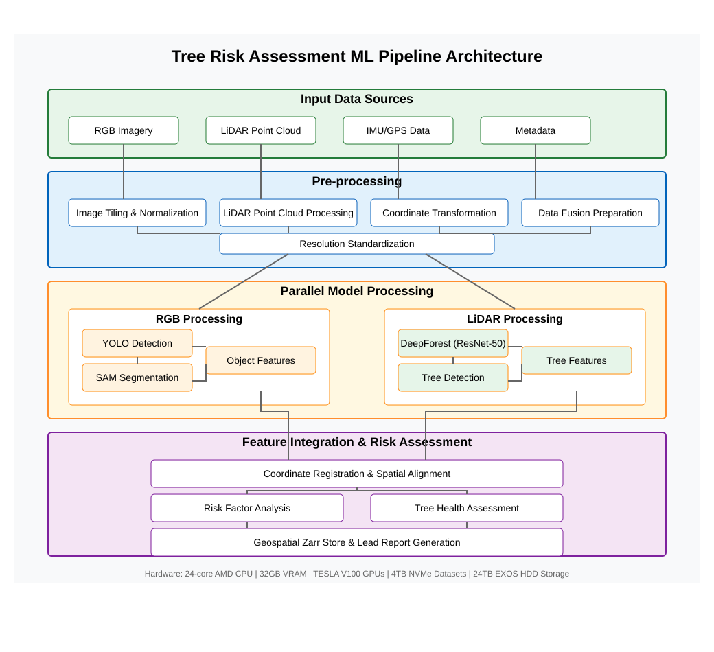

# Tree Risk Assessment ML Pipeline

A machine learning pipeline for processing multi-sensor geospatial data to detect, analyze, and assess tree health and associated risks.

## Overview

This system processes aerial and ground-based imagery combined with LiDAR point cloud data to identify trees, assess their health, and evaluate potential risks. The pipeline integrates multiple computer vision and deep learning models to provide comprehensive tree analysis, with specific focus on:

- Tree detection and segmentation
- Health assessment based on vegetation indices
- Risk evaluation for property damage
- Geospatial mapping and visualization

## System Architecture



The pipeline consists of four main components:

1. **Data Collection** (`src/data_collection.py`) - Handles gathering and validating input data from various sensors
2. **Image Processing** (`src/image_processing.py`) - Processes imagery with tree-specific enhancements
3. **Storage Management** (`src/zarr_store.py`) - Optimizes data storage with geospatial indexing
4. **Main Pipeline** (`pipeline.py`) - Coordinates the entire workflow

### Data Flow

```
Input Data → Data Collection → Image Processing → Storage → ML Analysis
```

## Features

- **Multi-sensor fusion**: Combines RGB imagery, LiDAR point clouds, and IMU/GPS data
- **Vegetation enhancement**: Specialized algorithms to improve tree detection
- **Advanced tree detection**: Uses YOLO + SAM + DeepForest models for precise tree identification
- **Geospatial indexing**: Optimized Zarr store with spatial queries
- **Parallel processing**: Multi-threaded design for performance optimization
- **Memory management**: Efficient handling of large datasets
- **Progress tracking**: Redis-based status updates and job queuing
- **Error resilience**: Comprehensive error handling and recovery

## Code Organization

The codebase is organized into modular components:

- **data_collection.py**: Handles data gathering with parallel processing and validation
- **image_processing.py**: Implements image tiling, transformations, and multi-sensor fusion
- **zarr_storage.py**: Manages data storage with geospatial indexing and caching
- **pipeline.py**: Coordinates the entire workflow and provides the command-line interface

## Installation

1. Clone the repository
```bash
git clone https://github.com/gsync-ai/ttt-service.git
cd ttt-service/pipeline
```

2. Create and activate a conda environment
```bash
conda env create -f environment.yml
conda activate tree-risk
```

3. Install additional dependencies
```bash
pip install -r requirements.txt
```

## Requirements

### Software Dependencies

- Python 3.8+
- OpenCV
- NumPy
- PyTorch
- Zarr
- Redis
- PyProj
- SciPy
- ONNX Runtime

### Hardware Requirements

- **CPU**: 24+ cores recommended
- **RAM**: 128GB+ recommended
- **GPU**: NVIDIA TESLA V100 or RTX 3090 (Min. 16GB VRAM)
- **Storage**: High-speed NVMe SSDs (4TB+ for large missions)

## Usage

### Command Line Interface

The main entry point is `pipeline.py`, which provides a comprehensive command-line interface:

```bash
# Process a complete mission
python pipeline.py --mission mission_123

# List available missions
python pipeline.py --list

# Check mission status
python pipeline.py --status mission_123

# Process a single image
python pipeline.py --image path/to/image.jpg

# Use custom configuration
python pipeline.py --mission mission_123 --config config.yaml
```

### Configuration

The pipeline uses a configuration dataclass defined in `data_collection.py`. You can customize the configuration using:

1. **Configuration files** (JSON or YAML)
```yaml
# config.yaml
input_path: "/data/input"
output_path: "/data/zarr"
vegetation_enhancement: true
max_workers: 16
```

2. **Environment variables**
```bash
export TREE_PIPELINE_INPUT_PATH="/data/input"
export TREE_PIPELINE_VEGETATION_ENHANCEMENT=true
export TREE_PIPELINE_MAX_WORKERS=16
```

### Python API

You can also use the pipeline programmatically:

```python
from pipeline import Pipeline, load_config
import asyncio

async def process_my_mission():
    config = load_config("config.yaml")
    pipeline = Pipeline(config)
    result = await pipeline.process_mission("mission_123")
    print(f"Processing completed: {result}")

asyncio.run(process_my_mission())
```

## Data Directory Structure

The pipeline expects data to be organized as follows:

```
/data/input/
  └── mission_123/
      ├── rgb/
      │   ├── image1.jpg
      │   ├── image2.jpg
      │   └── ...
      ├── lidar/
      │   ├── scan_001.npy
      │   ├── scan_002.npy
      │   └── ...
      ├── imu/
      │   └── imu_data.csv
      └── metadata.json

/data/zarr/
  └── mission_123_20250226_123456/
      ├── frames/
      ├── metadata/
      ├── tree_data/
      └── geospatial/
```

## Zarr Store Structure

The output Zarr store is organized as follows:

```
mission_123_20250226_123456/
  ├── frames/
  │   ├── rgb                 # RGB image data
  │   ├── vegetation_index    # Vegetation indices for tree health
  │   ├── vegetation_mask     # Binary masks of vegetation
  │   ├── lidar_points        # 3D LiDAR points
  │   ├── lidar_transformed   # Transformed LiDAR points in image space
  │   └── world_coordinates   # Geospatial coordinates for tiles
  ├── metadata/
  │   ├── mission/            # Mission-specific metadata
  │   ├── weather/            # Weather conditions
  │   └── processing/         # Processing metrics
  ├── tree_data/
  │   ├── vegetation_stats    # Statistics about vegetation coverage
  │   └── height_stats        # Tree height statistics from LiDAR
  └── geospatial/
      ├── spatial_index       # Spatial index for efficient queries
      └── boundary            # Boundary polygon of covered area
```

## Performance Optimization

The pipeline includes several optimizations:

- **Parallel processing**: Multi-threaded execution for data collection and processing
- **Memory management**: Efficient handling of large arrays with cleanup
- **Chunked storage**: Optimized Zarr chunks for spatial and tree-specific access patterns
- **Redis caching**: High-priority data chunks are cached in memory
- **Adaptive processing**: Serial or parallel execution based on data characteristics
- **Progress reporting**: Detailed status updates during processing

## Acknowledgments

- DeepForest for pre-trained tree detection models
- SAM team at Meta Research
- Ultralytics for YOLO implementation
- Zarr community for efficient array storage

## Contact

For questions or support, please contact [ss@gsync.io](mailto:ss@gsync.io).